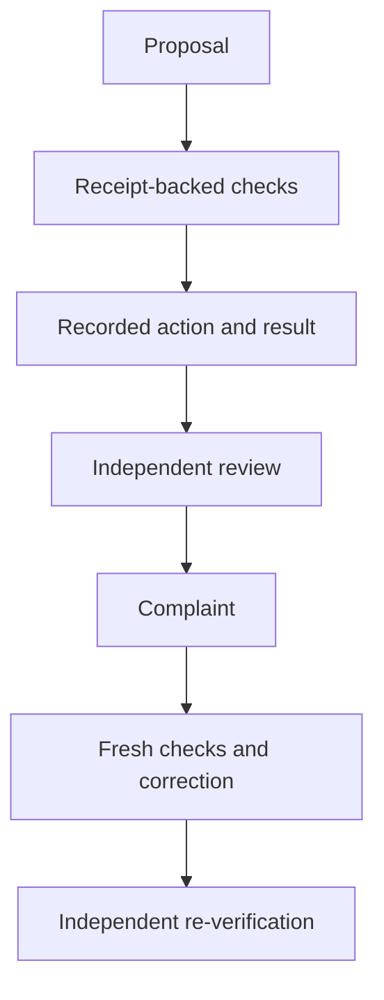

# Keep the original when a decision changes

A task reports success. A later check contradicts it. Replacing the success record loses the sequence that explains what happened. The Nucleus decision-review extract keeps the proposal, supplied checks, action receipt, review, complaint and correction as separate records.

Consider a synthetic file check. A worker records that the fixture passed. A separate reviewer accepts the supplied evidence. A later complaint identifies an omitted check. The reviewer requests a correction, the worker supplies fresh checks and result receipts, and the reviewer records the corrected outcome. The original proposal remains available throughout.

## What the library enforces

Principals have exact roles and project scopes. Unknown or failed checks hold the decision. A passing check without its required receipt becomes unknown. An actor involved in proposing, evaluating or recording an action cannot review that same decision. A correction needs fresh receipt digests and retains earlier history.

Receipt files are bounded, confined to a configured root and copied into the SQLite store. Hash checks detect mismatches in stored histories and receipt bytes. Tests cover self-review, unauthorized scope, corrupted history, missing stores, stale correction checks and repeated proposal identifiers.

The companion event outbox handles a different problem. It atomically saves a narrow event envelope and pending row. Retrying the exact event counts once; changing content under the same identity is a conflict. This avoids treating network or process retries as additional observed work.

## What remains the caller's responsibility

The application must authenticate actors and supply trusted grants. A receipt can contain a false statement; its hash only identifies bytes. An independent actor ID does not prove independent human judgment. An administrator can replace a complete database and its hashes.

The decision library records action evidence but never runs the action. Its state explicitly reports that it grants no execution authorization. The outbox has no sender or acknowledgment method and reports delivery as unconfigured. Neither component proves a public blockchain record, billable AI exchange or business outcome.

The prepared extract has 15 decision-review tests and 16 outbox tests, all passing locally. The package's complete offline demonstration walks through acceptance, dispute and correction. [Publication status](publication-status.md) records the source-release boundary.
