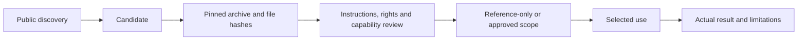

# Review the exact skill you plan to use

An agent skill may contain instructions, scripts and dependencies. A repository's popularity says little about what one selected directory will ask an agent to do. Skill Hub records the source revision, selected files, review evidence and actual use separately.

The workflow starts with two bounded discovery lanes: established repositories ranked by stars and recently created repositories ranked by update. Search results remain candidates. The reviewer chooses a specific skill path at a full commit SHA and stages it in quarantine without executing its contents.

## The review record

A useful record names the purpose, source identity, exact license scope, files read, requested capabilities, performed tests and remaining restrictions. Reading art-direction guidance supports a reference-only decision; it does not establish that accompanying scripts are safe to execute.

When a registered skill changes, its prior approval does not silently transfer. The registry compares content hashes and can place a changed skill on integrity hold. Upstream update checks report a new revision for review without replacing an installed copy.

Owner permission is recorded separately from content review. A snapshot can describe what the owner authorized without promoting candidates or adding future discoveries. A local record of permission is not identity verification or a replacement for the host's execution policy.

## Practical boundaries

Archive checks reject traversal, symlinks, device paths, collisions and excessive expansion. Static pattern flags are prompts for inspection, not a safety verdict. A reviewer must still inspect instructions, scripts, dependency behavior and rights at the selected version.

Public technical search terms leave the computer; project labels and review notes stay local. The generated registry views can include local paths and requests, so they should remain private unless deliberately sanitized. Files outside a skill directory are outside its content hash and need separate review.

The prepared standalone extract has 56 passing local regression tests. They cover content changes, review requirements, archive boundaries, partial search results, token opt-in and preservation of review states. No third-party skill content is republished in the extract. [Publication status](publication-status.md) distinguishes the tested local package from a public source release.
